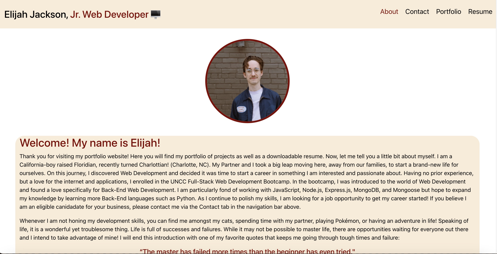

 # <h1 align="center">React Portfolio</h1>

 
 

Deployed Portfolio: https://ejackson1228.github.io/profession-port/

## Description
This application is my personal portfolio built with React.js. Here, you will find an about me, contact, portfolio, and resume section. Within these sections you will find all my credentials, highlighted projects, and a downloadable iframed resume. 
  
## Table of Contents
  - [Description](#description)
  - [Contributors](#contributors)
  - [Questions](#questions)

## Contributors
React.js, emailJS, react-toast

## Questions? Contact me:
GitHub: https://github.com/ejackson1228/  
Email: ejackson1228@gmail.com